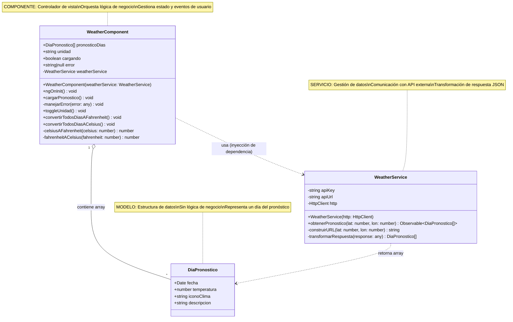
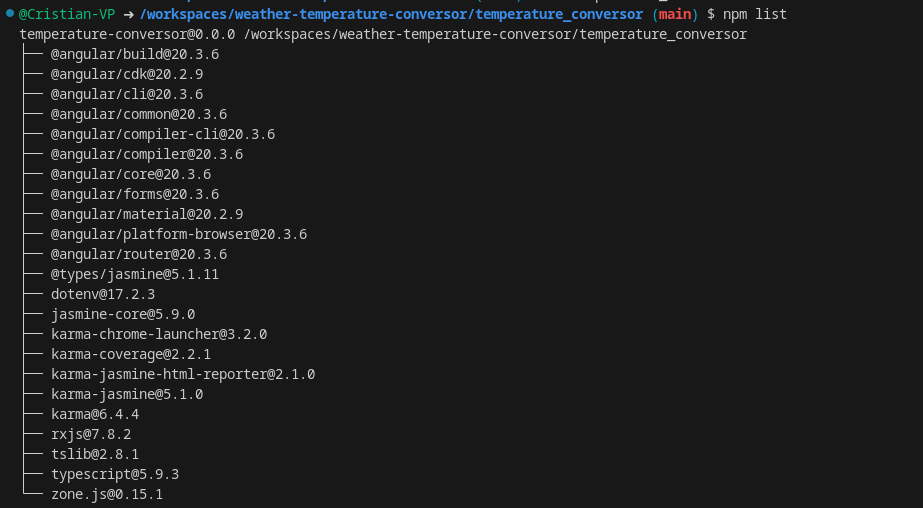
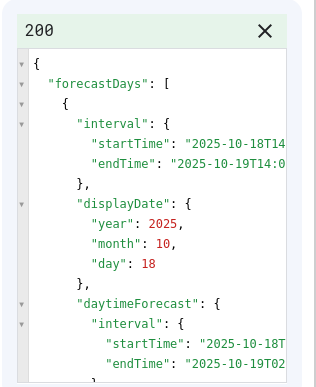
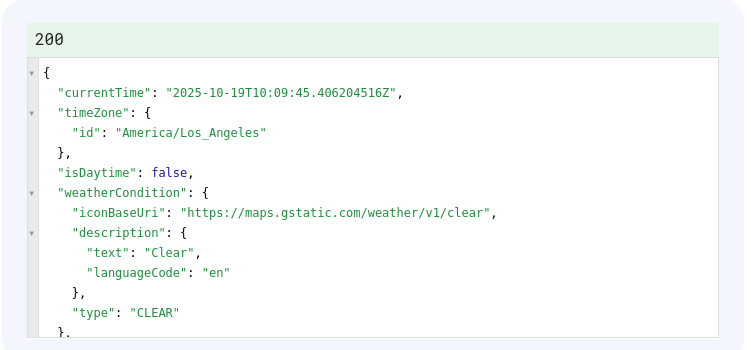
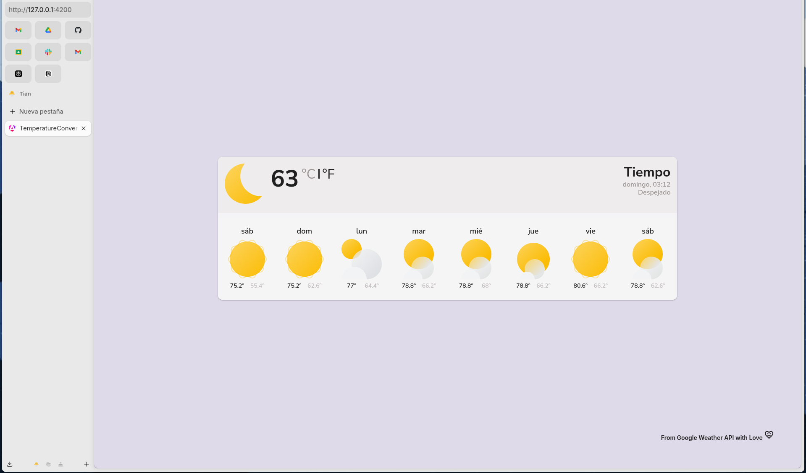

# conversor

# Conversor de Temperatura y Consulta Meteorológica

Este proyecto es una aplicación Angular que integra la conversión de temperaturas entre escalas (Celsius, Fahrenheit) y la consulta de datos meteorológicos en tiempo real mediante una API externa, en específico la Google Weather API . Su desarrollo responde a la necesidad de ilustrar conceptos fundamentales de desarrollo frontend moderno, consumo de servicios web y buenas prácticas en Angular y Material Angular.

## Motivación e Intención

El conversor nace como recurso educativo para demostrar:
- La integración de lógica matemática (conversión de unidades) en interfaces web.
- El consumo y manejo de APIs REST, incluyendo la gestión de respuestas asíncronas y errores.
- La estructuración de proyectos Angular usando componentes, servicios y modelos.

## Arquitectura y Estructura

El proyecto sigue la arquitectura recomendada por Angular, separando responsabilidades:

- **Componentes**: Encargados de la presentación y la interacción con el usuario. El componente principal orquesta la entrada de datos, la visualización de resultados y la comunicación con los servicios.
- **Servicios**: Gestionan la lógica de negocio y la comunicación con fuentes externas (APIs). El `weather.service.ts` encapsula las llamadas HTTP y el tratamiento de respuestas y errores.
- **Modelos**: Definen la estructura de los datos que maneja la aplicación, asegurando tipado fuerte y claridad en el flujo de información.



Las dependencias principales incluyen Angular Material para componentes UI y HttpClientModule para las solicitudes HTTP.
En el siguiente listado se detallan las dependencias usadas en el proyecto:



## Integración con la API de Google Weather

La aplicación realiza llamadas a dos endpoints principales de la API:

- **`forecast.days`**: Permite obtener el pronóstico meteorológico de los próximos 8 días para una ciudad seleccionada. Los datos recibidos se procesan y muestran en la interfaz, facilitando la visualización de tendencias y variaciones climáticas.
- **`currentConditions`**: Recupera las condiciones meteorológicas actuales, como temperatura, humedad y estado del cielo. Esta información se utiliza para componer la cabecera del banner principal de la aplicación, mostrando el clima en tiempo real.

El consumo de estos endpoints se realiza mediante el servicio `weather.service.ts`, que gestiona las peticiones HTTP y el tratamiento de las respuestas.

## Funcionamiento de la Conversión de Temperatura

La aplicación permite alternar entre Celsius y Fahrenheit. Al seleccionar una escala, la temperatura mostrada se actualiza dinámicamente en toda la interfaz, aplicando las fórmulas de conversión correspondientes. Esto garantiza que el usuario pueda consultar los datos en la unidad que prefiera, manteniendo la coherencia en la presentación.

```mermaid
sequenceDiagram
    participant U as Usuario
    participant VC as WeatherComponent<br/>(Vista + Controlador)
    participant WS as WeatherService<br/>(Gestor de Datos)
    participant API as Google Weather API<br/>(Externa)

    %% ══════════════════════════════════════════════════════════
    %% FASE 1: INICIALIZACIÓN DEL COMPONENTE
    %% ══════════════════════════════════════════════════════════
    
    Note over VC: Angular crea el componente
    activate VC
    VC->>VC: constructor(weatherService)
    Note right of VC: Inyecta el servicio<br/>via Dependency Injection
    
    VC->>VC: ngOnInit()
    Note right of VC: Hook del ciclo de vida<br/>Se ejecuta automáticamente<br/>al inicializar
    
    VC->>VC: cargando = true<br/>error = null
    Note right of VC: Activa indicador<br/>de carga en UI
    
    %% ══════════════════════════════════════════════════════════
    %% FASE 2: PETICIÓN DE DATOS A LA API
    %% ══════════════════════════════════════════════════════════
    
    VC->>WS: obtenerPronostico(lat, lon)
    activate WS
    Note right of WS: Recibe coordenadas<br/>geográficas
    
    WS->>WS: construirURL(lat, lon)
    Note right of WS: Construye URL con:<br/>- apiKey<br/>- parámetros lat/lon<br/>- formato JSON
    
    WS->>API: HTTP GET request
    activate API
    Note right of API: Petición HTTP a:<br/>Google Weather API<br/>con autenticación
    
    API-->>WS: JSON Response
    deactivate API
    Note left of API: Devuelve datos:<br/>- forecast (array)<br/>- temperature<br/>- weather icons
    
    WS->>WS: transformarRespuesta(json)
    Note right of WS: Mapea JSON a objetos<br/>DiaPronostico[]:<br/>fecha, temperatura,<br/>iconoClima
    
    WS-->>VC: Observable~DiaPronostico[]~
    deactivate WS
    Note left of WS: Emite array de pronósticos<br/>via Observable (patrón Rx)
    
    VC->>VC: pronosticoDias = datos
    VC->>VC: cargando = false
    Note right of VC: Almacena datos<br/>Desactiva spinner<br/>Angular actualiza vista
    
    VC->>U: Renderiza banner con 7 días
    deactivate VC
    Note right of U: Muestra UI con:<br/>MatCard por cada día<br/>Temperatura en °C
    
    %% ══════════════════════════════════════════════════════════
    %% FASE 3: INTERACCIÓN DEL USUARIO (Toggle C/F)
    %% ══════════════════════════════════════════════════════════
    
    U->>VC: Click en MatSlideToggle
    activate VC
    Note left of U: Usuario cambia unidad
    
    VC->>VC: toggleUnidad()
    
    alt unidad == "C"
        VC->>VC: unidad = "F"
        VC->>VC: convertirTodosDiasAFahrenheit()
        loop Para cada día en pronosticoDias
            VC->>VC: dia.temp = celsiusAFahrenheit(dia.temp)
            Note right of VC: Fórmula: (C × 9/5) + 32
        end
    else unidad == "F"
        VC->>VC: unidad = "C"
        VC->>VC: convertirTodosDiasACelsius()
        loop Para cada día en pronosticoDias
            VC->>VC: dia.temp = fahrenheitACelsius(dia.temp)
            Note right of VC: Fórmula: (F - 32) × 5/9
        end
    end
    
    Note right of VC: NO llama a la API<br/>Solo transforma datos<br/>existentes en memoria
    
    VC->>U: Actualiza vista con nuevas temperaturas
    deactivate VC
    Note right of U: Angular detecta cambios<br/>y re-renderiza automáticamente
    
    %% ══════════════════════════════════════════════════════════
    %% FASE 4: MANEJO DE ERRORES (Flujo alternativo)
    %% ══════════════════════════════════════════════════════════
    
    Note over VC,API: FLUJO ALTERNATIVO: Error en API
    
    VC->>WS: obtenerPronostico(lat, lon)
    activate WS
    WS->>API: HTTP GET request
    activate API
    API-->>WS: Error 401/500/Network
    deactivate API
    
    WS->>WS: catchError()
    Note right of WS: Captura error HTTP<br/>Lanza excepción
    
    WS-->>VC: Error Observable
    deactivate WS
    
    VC->>VC: error = "No se pudo obtener..."<br/>cargando = false
    Note right of VC: Actualiza estado<br/>Muestra mensaje al usuario
    
    VC->>U: Muestra MatSnackBar con error
    Note right of U: Notificación temporal<br/>con mensaje de error

···

    deactivate VC
``` 
    
## Refactorización y Manejo de API Key

Durante el desarrollo, se realizó una refactorización del JSON recibido desde la API para simplificar y estructurar mejor los datos utilizados en la aplicación. Además, se implementó un manejo seguro de la API Key, evitando su exposición directa en el código fuente y facilitando su configuración mediante variables de entorno o archivos protegidos.

En esta consulta obtenemos un JSON con los n dias de forecast:  

  

En esta consulta obtenemos un JSON con las condiciones actuales:



## Resultados

En su desarrollo se implemento Material Angular, haciendo uso de etiquetas semanticas. En el desarrollo de las reglas de estilo  
solo se uso CSS jerarquico y atomizado a cada pantalla desde main.css, app.css y weather.component.css.  

Pantalla principal de la aplicación:


